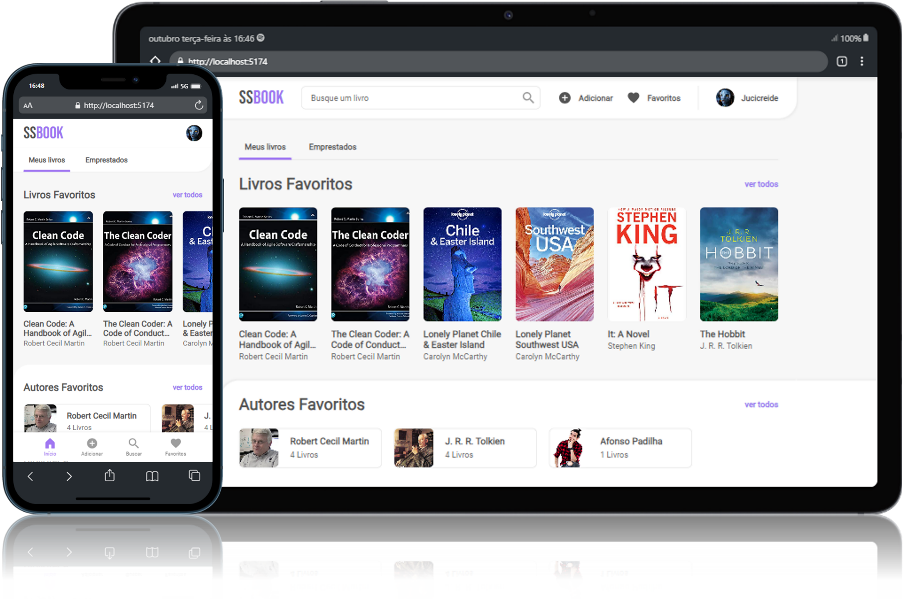

# Prova front-end - Studio Sol



Aplicação em React para gerenciar os livros do usuário, mostrando sua biblioteca de livros e informações a respeito de cada livro.

## Instalar e Executar a aplicação

Para instalar as dependências utilize o comando:

```console
npm i
```

O projeto foi criado utilizando Vite. Então, para rodar a aplicação localmente, utilize o comando:

```console
npm run dev
```

## Tecnologias utilizadas

- Typescript: para adicionar tipagem estática e ajudar na detecção de erros no código.
- Axios: para fazer requisições à API em GraphQL.
- React Query: para gerenciamento automático de estado e requisições rápidas e eficientes.

## Comandos úteis

Com a aplicação rodando, na linha de comando:

- Tecla "o" abre a aplicação no navegador.
- Tecla "q" encerra a aplicação.
- Tecla "h" mostra todos os comandos disponíveis.
